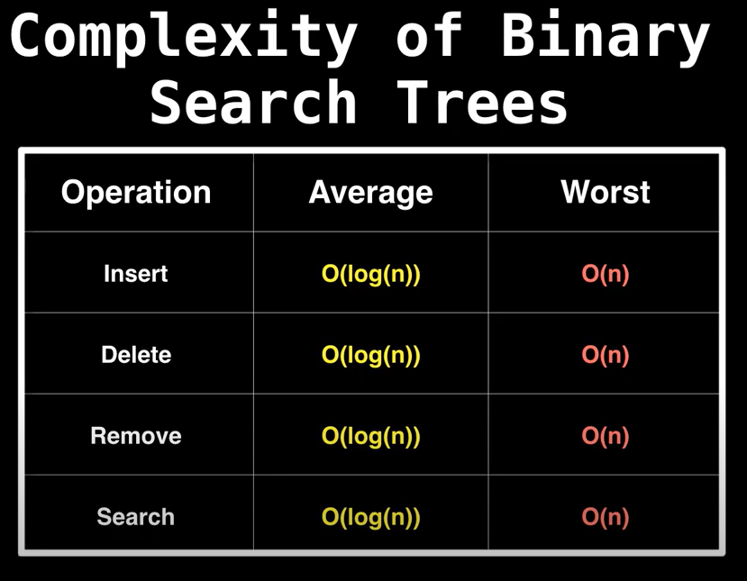
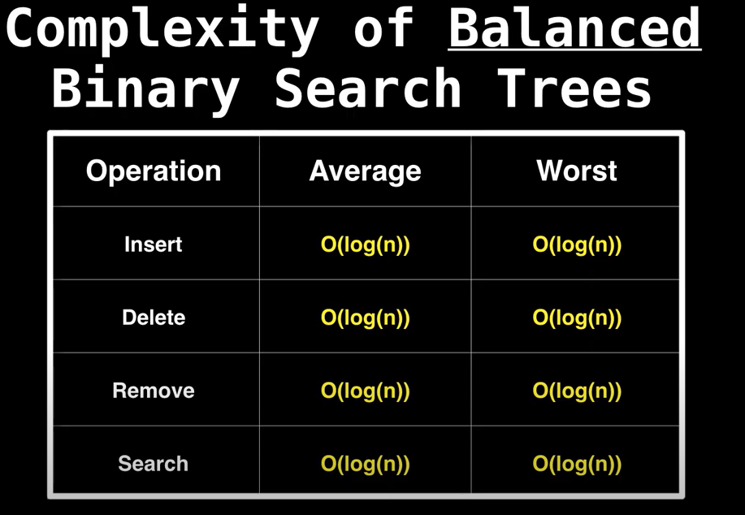

# Search
Topics: 
- Binary Search Tree (BST)
- Balanced Binary Search Tree (BBST)

# Binary Search Tree 
[Binary Search Trees (BST) Explained in Animated Demo](https://www.youtube.com/watch?v=mtvbVLK5xDQ)

- Each node is greater than every node in its left subtree
- Each node is less than every node in its right subtree

Operations:
- Insert:
  - Start at root
  - Perform comparison with node (if greater, go right. If less than, go left).
  - Keep iterating. 
  - Insert new node as a leaf.
- Find:
  - Start at root 
  - Perform comparison with node (if greater, go right. If less than, go left).
  - Keep iterating. 
- Delete:
  - 3 possible cases:
    - (delete) Leaf node
      - Start at root
		  - Perform comparison with node
		  - Keep iterating until found
		  - Delete leaf node 
	  - (delete) node with 1 child
		  - Start at root
      - Perform comparison with node
      - Keep iterating until found 
      - Remove node, link child to parent. 
    - (delete) node with 2 children 
		  - Start at root
      - Perform comparison with node
      - Keep iterating until found
      - Once found, find next higher node for the removed node by iterating down the tree until leaf 
      - Swap positions between next highest node, and delete removed node 

Time complexity (average/balanced BST):
- O(h) = O(log n), where h = height of tree, for all operations
  - Find
  - Insert
  - Delete 

Over time, the more delete operations are performed, we start to change the structure of the tree and degrade the tree until it reaches it's worst case (below). 
Time complexity (worst - when a tree degrades into a chain):
- O(n), for all operations
  - Find
    - Insert
    - Delete 

# Balanced Binary Search Tree
[Balanced binary search tree rotations](https://www.youtube.com/watch?v=q4fnJZr8ztY)

Balanced BST ensures that worst case is O(log n) for all operations!

To achieve a Balanced BST, two concepts will need to be applied: 
- Tree Rotations
- Tree invariant - a property/rule that is imposed after every operation
  - For every node (N): 
    - N.leftSubtree < N
    - N.rightSubtree > N 

Types of balanced BST: 
- AVL trees 
- B-Trees 
- Red-black trees 
